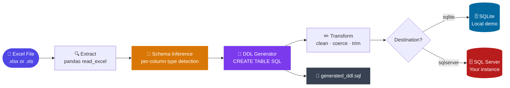
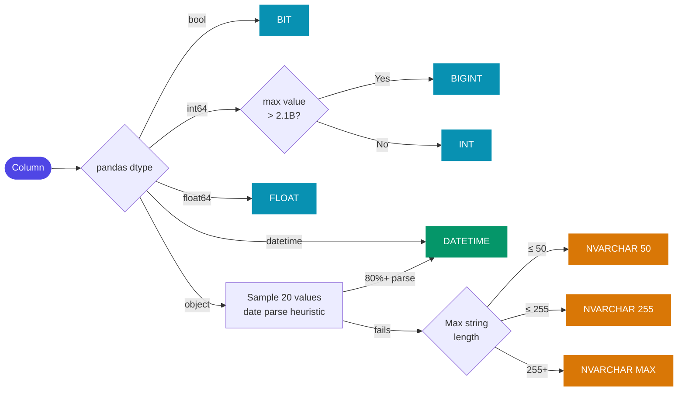

<div align="center">

<br/>

# 🔄 Python ETL Pipeline

### Excel → Schema Inference → SQL

**Drop in any Excel file. Python reads it, understands it, builds the table, and loads it.**

<br/>


<br/>

</div>

---

## The Problem

Every data team has a version of this workflow:

> *Someone hands you an Excel file. You open it, manually inspect the columns, write a `CREATE TABLE` statement, clean up the headers, figure out which fields are nullable, and paste it into SQL Server. Then you do it again next month with a slightly different file.*

The repetitive part — reading the file structure, deciding column types, writing DDL, cleaning names — is something Python can do automatically. This project does exactly that.

---

## Pipeline Overview



---

## Schema Inference Engine

The core of the project. Instead of hand-writing column definitions, the pipeline inspects each column and assigns the most precise SQL type automatically:



**Example — inference report for the bundled Sales dataset:**

| original_name | clean_name | pandas_dtype | sql_type | null_count | null_pct |
|---|---|---|---|---|---|
| Order ID | order_id | object | NVARCHAR(50) | 0 | 0.0% |
| Order Date | order_date | object | **DATETIME** | 0 | 0.0% |
| Ship Date | ship_date | object | **DATETIME** | 0 | 0.0% |
| Customer Name | customer_name | object | NVARCHAR(50) | 2 | 0.8% |
| Sales | sales | float64 | FLOAT | 0 | 0.0% |
| Quantity | quantity | int64 | INT | 0 | 0.0% |
| Profit | profit | float64 | FLOAT | 10 | 4.0% |
| Returned? | returned | bool | **BIT** | 0 | 0.0% |

> `Order Date` is stored as a string in Excel — the heuristic correctly promotes it to `DATETIME`. `Returned?` maps to `BIT`. `NULL` vs `NOT NULL` is set from real data counts.

---

## Auto-Generated DDL

From the inference report, a complete `CREATE TABLE` is written for you and saved to `generated_ddl.sql`:

```sql
-- Auto-generated by etl_pipeline.py  |  2026-03-05 03:01:25
CREATE TABLE [dbo].[sales_data] (
    [order_id]       NVARCHAR(50)  NOT NULL,
    [order_date]     DATETIME      NOT NULL,
    [ship_date]      DATETIME      NOT NULL,
    [ship_mode]      NVARCHAR(50)  NOT NULL,
    [customer_name]  NVARCHAR(50)  NULL,         -- nullable: detected from data
    [segment]        NVARCHAR(50)  NOT NULL,
    [state]          NVARCHAR(50)  NOT NULL,
    [region]         NVARCHAR(50)  NOT NULL,
    [category]       NVARCHAR(50)  NOT NULL,
    [sub_category]   NVARCHAR(50)  NOT NULL,
    [sales]          FLOAT         NOT NULL,
    [quantity]       INT           NOT NULL,
    [discount]       FLOAT         NOT NULL,
    [profit]         FLOAT         NULL,         -- nullable: detected from data
    [returned]       BIT           NOT NULL
);
```

---

## Transform Stage

Before loading, the pipeline applies four lightweight transformations:

| Before | After | What changed |
|---|---|---|
| `"Order ID"` | `order_id` | snake_case |
| `"Order Date"` (string) | `order_date` (datetime64) | date coercion |
| `"Sub-Category"` | `sub_category` | hyphen removed |
| `"  Customer  "` | `Customer 0066` | whitespace trimmed |
| `True / False` | `1 / 0` | bool normalised |

- **Column names** → `snake_case` (spaces, hyphens, special chars handled)
- **Strings** → leading/trailing whitespace stripped
- **Date-like text columns** → coerced to proper `datetime`
- **Fully empty rows** → dropped

---

## Configuration

Everything is controlled from `config.yaml` — no code changes needed.

**Use your own Excel file:**

```yaml
source:
  use_sample_dataset: false
  local_file_path: "C:/data/my_report.xlsx"
  sheet_name: "Sheet1"
  skip_rows: 2
```

**Switch to SQL Server:**

```yaml
destination:
  mode: "sqlserver"
  table_name: "sales_data"
  schema: "dbo"
  batch_size: 500
  if_table_exists: "replace"   # or "append" / "fail"

sql_server:
  server: "YOUR_SERVER"
  database: "YOUR_DATABASE"
  trusted_connection: true     # Windows Auth
  driver: "ODBC Driver 17 for SQL Server"
```

**SQL Server Authentication:**

```yaml
sql_server:
  server: "myserver.database.windows.net"
  database: "MyDatabase"
  username: "sa"
  password: "YourPassword"
  trusted_connection: false
```

---

## Quick Start

```bash
# 1 — Clone
git clone https://github.com/kage77/python-etl-pipeline
cd python-etl-pipeline

# 2 — Install
pip install -r requirements.txt

# 3 — Run  (sample dataset downloads automatically)
python etl_pipeline.py
```

**CLI overrides — no config editing needed:**

```bash
python etl_pipeline.py --file "report.xlsx"
python etl_pipeline.py --file "report.xlsx" --table "my_table" --mode sqlserver
python etl_pipeline.py --config path/to/custom_config.yaml
```

**Self-contained demo (no internet or SQL Server required):**

```bash
python demo_run.py
```

---

## Sample Output

```
━━━━━━━━━━━━━━━━━━━━━━━━━━━━━━━━━━━━━━━━━━━━━━━━━━━━━━━━━
  ETL PIPELINE STARTED — 2026-03-05 03:01:25
━━━━━━━━━━━━━━━━━━━━━━━━━━━━━━━━━━━━━━━━━━━━━━━━━━━━━━━━━
[INFO]  Config loaded from config.yaml
[INFO]  Downloading sample dataset...
[INFO]  Extracted  →  250 rows × 15 columns
[INFO]  Schema inference complete — 15 columns mapped
[INFO]  DDL saved → generated_ddl.sql
[INFO]  Column names → snake_case
[INFO]  Transform complete → 250 rows × 15 columns
[INFO]  Batch 1/3  →  100 rows committed
[INFO]  Batch 2/3  →  100 rows committed
[INFO]  Batch 3/3  →   50 rows committed
━━━━━━━━━━━━━━━━━━━━━━━━━━━━━━━━━━━━━━━━━━━━━━━━━━━━━━━━━
[INFO]  LOAD COMPLETE
[INFO]  Rows loaded  : 250 / 250
[INFO]  COUNT(*)     : 250  ✓
━━━━━━━━━━━━━━━━━━━━━━━━━━━━━━━━━━━━━━━━━━━━━━━━━━━━━━━━━
```

---

## Project Structure

```
python-etl-pipeline/
│
├── etl_pipeline.py   ← main pipeline (extract · schema · ddl · transform · load)
├── demo_run.py       ← self-contained demo, no internet or SQL Server needed
├── config.yaml       ← all configuration in one place
├── requirements.txt
├── .gitignore
└── README.md
```

> **Runtime files (not committed):** `etl_demo.db` · `generated_ddl.sql` · `etl_pipeline.log`

---

## Where to Take It Next

- **Validation layer** — enforce null thresholds, row count checks, and type mismatch alerts before load
- **Delta loads** — watermark tracking to only pull rows newer than the last run
- **Multi-sheet** — loop over every sheet in a workbook automatically
- **Cloud sources** — swap the file reader for Azure Blob, SharePoint, or S3
- **Orchestration** — wrap `run_pipeline()` as an Airflow task or Windows Task Scheduler job

---

## Requirements

- Python 3.9+
- `pandas` · `openpyxl` · `xlrd` · `PyYAML` · `sqlalchemy` · `requests`
- SQL Server mode only: `pyodbc` + [ODBC Driver 17+](https://learn.microsoft.com/en-us/sql/connect/odbc/download-odbc-driver-for-sql-server)

```bash
pip install -r requirements.txt

# SQL Server mode only:
pip install pyodbc
```

---

<div align="center">

MIT License · [github.com/kage77/python-etl-pipeline](https://github.com/kage77/python-etl-pipeline)

⭐ If this helped you, consider starring the repo

</div>
